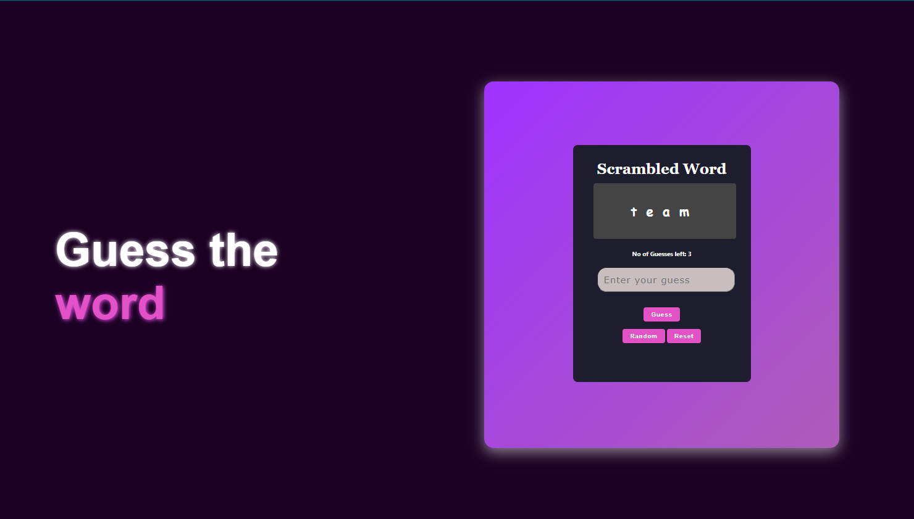

# 🎮 Guess the Word Game

An interactive and visually engaging **Word Guessing Game** built using **HTML**, **CSS**, and **JavaScript**. The player must identify the correct word from a scrambled version within a limited number of attempts. The UI is designed with modern visual elements and fully adapts across all screen sizes.

---

## 📷 Preview

> 

---

## 🚀 Features

* 🎨 **Elegant Design**: Dark-themed layout with vibrant gradients, modern shadows, and responsive typography.
* 🔠 **Dynamic Gameplay**: Randomly selects and scrambles words from a predefined set of 50 unique words.
* ❌ **Live Feedback**: Highlights incorrect letters and limits guesses based on word length.
* 🔁 **Smart Controls**: Includes "Reset" and "Random" buttons to replay or switch the challenge instantly.
* 📱 **Mobile-Responsive**: Layout adapts seamlessly for desktops, tablets, and smartphones using Flexbox and media queries.

---

## 🛠️ Technologies Used

* **HTML5** – Markup structure for semantic elements.
* **CSS3** – Styling with gradients, card components, Flexbox layout, shadows, and media queries for responsiveness.
* **Vanilla JavaScript** – Handles word generation, user input, validation, and dynamic DOM updates.

---

## 🎮 How to Play

1. Open the game in a browser: 👉 [https://whack-a-word.vercel.app/](https://whack-a-word.vercel.app/)
2. A scrambled word appears in a stylized card.
3. Enter your guess in the input field and click the **"Guess"** button.
4. The game provides:

   * ✅ “You Win 🎉🎉” on correct guess.
   * ❌ Highlighting of incorrect letters.
   * ⏳ Attempt reduction based on word length.
5. Click **"Random"** to load a new word.
6. Click **"Reset"** to restart the current round.

---

## 🖼️ Responsive Layout Highlights

* 💻 On desktops (width > 1200px):

  * Dual-panel layout with wide spacing for clarity.
  * Large header text and centrally aligned card with shadows.
* 📱 On tablets (≤ 900px):

  * Panels stack vertically for compactness.
  * Font sizes and card dimensions adjust automatically.
* 📱 On mobile devices (≤ 600px):

  * Simplified and fluid design with centered alignment.
  * Input box and buttons stretch to full width for better usability.
  * Optimized card height with scroll support for small screens.

---
